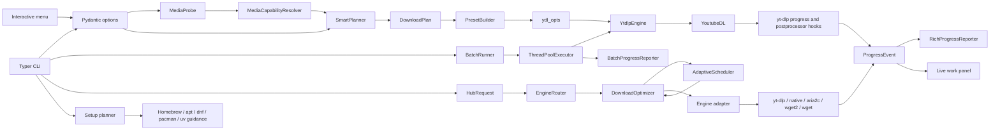

# Architecture

`atlas` is an installable Python package, not a loose script. It uses `yt-dlp`
through the Python API as the primary media engine, and it can also coordinate
direct-file and website backends such as aria2c, wget2, and wget. CLI rendering
stays separate from download execution.

For the normative ownership, progress, artifact, safety, and verification
rules, see [System Contracts](system-contracts.md). This page explains the
shape of the system; the contracts page defines what must stay true when code
or docs change.

## Goals

- Provide beautiful, calm defaults for common YouTube and Rumble downloads.
- Provide one central hub for media, direct files, explicit website mirrors, and
  explicit open-directory mirrors.
- Make `atlas` feel like a calm terminal app first, with commands as the
  scriptable layer underneath the same planner.
- Let users describe intent, not raw `yt-dlp` internals.
- Tune direct-file and batch concurrency from measured metadata instead of fixed guesses.
- Keep single-video behavior safe by default.
- Make explicit playlist downloads deliberate.
- Run batch queues with bounded, visible concurrency.
- Keep the core engine testable and independent from Rich UI.
- Fail early for local setup problems such as missing `ffmpeg`.
- Provide manager-aware bootstrap/setup/update paths on macOS and supported
  Linux hosts without hiding system changes.

## High-Level Flow

```text
interactive menu or CLI command
  -> shared FetchClient / directory parser when scans are needed
  -> pydantic request model
  -> optional metadata probe or hub route
  -> media capability resolver when source formats are known
  -> EngineRouter
  -> DownloadOptimizer
  -> optional AdaptiveScheduler plan
  -> SmartPlanner or backend planner
  -> PresetBuilder
  -> engine adapter
  -> yt-dlp/native/aria2c/wget2/wget
  -> ProgressEvent
  -> progress reporter
  -> DownloadResult
```

Advanced backend pass-through:

```text
CLI command or menu advanced action
  -> BackendCommandPlan
  -> safe argv subprocess runner
  -> yt-dlp / aria2c / wget2 / wget CLI
  -> captured or streamed output
```

Setup and update lifecycle:

```text
install.sh / atlas setup / doctor --fix
  -> detect OS, architecture, shell, package manager, install method
  -> build and render the complete setup/bootstrap plan
  -> obtain one Atlas-level approval
  -> run approved package-manager and Atlas install commands in order
  -> run atlas setup --MODE to initialize Atlas paths and configuration
  -> run atlas setup --MODE --no-install for final plan-only verification
  -> doctor verification
  -> menu
```



The interactive menu is the primary human front door. `atlas get` is the
scriptable smart-download hub command, but it is not a separate shortcut path.
High-level commands such as `video`, `audio`, `file`, `site`, `dir`, `playlist`,
and batch item execution all construct a hub execution plan before running.
Batch auto mode plans each URL independently; possible site or directory mirrors
are skipped unless `--allow-sites` or `--allow-dirs` is explicit. This keeps
command-specific flags while sharing routing, optimization, safety notes, and
adapter boundaries.

The interactive menu is also a front door into this same path. It prompts for
the smallest useful intent, builds existing Pydantic options, previews the hub
execution plan, and then calls the same execution helpers as command mode.
For media URLs, the menu probes first, builds a real format catalog, and shows
source-aware profiles before asking for detailed codec/container choices. This
keeps impossible combinations out of the normal flow while preserving raw
`--format` as an advanced escape hatch.
For Batch sessions, the menu can either run the traditional URL-list file queue
or scan one seed URL first. The URL-scan branch is still planner-driven: the
chosen recursive directory, offline website, or single-file action becomes
`DirectoryMirrorOptions`, `SiteDownloadOptions`, or `FileDownloadOptions` before
execution. The scan branch classifies discovered same-host files, folders, HTML
pages, and media, counts external links separately, estimates size when the URL
shape is informative, and shows a recommended mode before the user accepts or
customizes the plan.
Directory-like URLs branch into the Directory Explorer first: Atlas performs a
fast visible root map, shows folders/files before any deep crawl, then
deep-scans only the selected roots. If the selected roots already resolve to
exact file URLs, Atlas prefers an exact-list batch session; otherwise it queues
an explicit directory session for the chosen roots.

Standalone real `atlas dir` execution also scans before mutation. Complete
signature-recognized CopyParty text/HTML indexes become a bounded
`native-exact-index` plan: same-host files only, depth/filter/file/size/runtime
guards, safe relative destinations, and one native file transfer at a time.
Conventional HTML directory trees remain explicit Wget2/Wget recursion.

Adaptive runs add a pre-execution evidence layer. Direct files use HTTP probes;
site and directory mirrors inspect the starting document; batches probe every
direct file, scan every allowed site/directory item, and route-classify media
without a metadata probe. The resulting
`AdaptiveDownloadPlan` carries queue concurrency, per-host caps, per-file
segments, max total connections, max per-host connections, postprocessor budget,
backend preference, size counts, bucket counts, host counts, mirror bounds, and
safety notes.
Its `work_items` manifest records URL, kind, host, estimated size, range
support, checksum metadata when known, recursion depth, selected backend,
priority, bucket, and scheduler decision. The mixed-engine batch scheduler owns URL slots;
aria2, native, Wget2/Wget, and yt-dlp still own per-item transfer mechanics.
Only runnable rows are submitted to worker threads. Per-host-capped and paused
rows remain pending so one blocked host cannot occupy the executor. An all-aria2
RPC batch instead queues all items immediately, applies only a global adaptive
queue, and binds no operator controls. Shared aria2 work caches its last global
options to avoid redundant control calls.

All optimized plans also carry a `SmartDownloadSession`. This is the shared
abstraction for video, audio, playlists, direct files, site mirrors, directory
mirrors, and batches:

```text
SmartDownloadSession
  source
  detected_kind
  intent
  session_type
  manifest
  plan
  customization
  scheduler_policy
  progress_reporter
  final_summary
```

Mode-specific commands only choose a preset on top of this session. For example,
`playlist` becomes `media_playlist`, `dir` becomes `directory_session`, and a
mixed URL file becomes `batch_session`. The session envelope is planner-owned;
backend adapters still receive their native typed options.

Human rendering is the matching view layer, not a backend concern.
`atlas.views.SmartSessionView` builds reusable header cards, scan/probe panels,
plan previews, customization overlays, progress dashboards, active work tables,
scheduler panels, failure drawers, summaries, and syntax-highlighted previews.
It consumes simple view rows and normalized progress state. Backends must not
emit Rich UI or rely on stdout logs for normal progress.

The live work panel is a UI concern layered above normalized progress events.
`WorkPanelContext` carries stable plan facts such as mode, backend, output
directory, archive state, queue count, and safety badges. Transfer speed,
elapsed time, current phase, done/error state, and batch totals are derived from
`ProgressEvent` instances emitted by yt-dlp hooks, direct-file backends, site
mirror backends, or CLI-side preflight markers.

Advanced pass-through is deliberately separate from the planner. It exists to
cover every backend-specific command and flag while keeping normal atlas usage
menu-first and plan-driven. Pass-through commands still use safe argv execution, plan panels,
dry-runs, JSON output, and friendly dependency errors.

## Module Map

| Module | Responsibility |
| --- | --- |
| `cli.py` | Typer commands, Rich panels/tables, user-facing errors. |
| `menu.py` | Questionary-backed interactive launcher, menu state, and prompt-to-option mapping. |
| `models.py` | Pydantic models and enums for requests, plans, results, formats, doctor reports. |
| `planner.py` | Intent-based planning from user choices to `DownloadPlan`. |
| `media_capabilities.py` | Probe-driven media catalogs, safe profiles, exact format choices, and conversion warnings. |
| `network.py` | Shared verified GET/HEAD fetch client for probes, scan pages, TLS fallback, and typed fetch errors. |
| `presets.py` | Centralized conversion from `DownloadPlan` to concrete `ydl_opts`. |
| `engine.py` | Thin UI-free wrapper around `yt_dlp.YoutubeDL`. |
| `hub.py` | `EngineRouter` and conservative URL-to-intent routing for `get`. |
| `optimizer.py` | `DownloadOptimizer` for turning routes into safe typed options and previews. |
| `sessions.py` | Shared `SmartDownloadSession` builders for media, file, mirror, and batch presets. |
| `passthrough.py` | Advanced raw backend command planning for yt-dlp, aria2c, wget2, and wget. |
| `file_probe.py` | Lightweight HTTP metadata probe for direct-file backend optimization. |
| `directory_parser.py` | Stable facade for directory-index parsing contracts. |
| `directory_index.py` | Conventional HTML and signature-recognized CopyParty row parsing, completeness metadata, and work-item conversion. |
| `directory_scanner.py` | Typed directory scan results, scan errors, and status translation from scan work items. |
| `directory_tree.py` | Visible folder-tree modeling for open-directory browsing. |
| `directory_explorer.py` | Valid pre-download actions for root maps, selected folders, and deep-scan flows. |
| `adaptive.py` | Scan-first work-item classification, URL/scan warnings, adaptive queue planning, per-host gating, and runtime backoff. |
| `adapters.py` | Engine adapter boundary for yt-dlp, direct files, and site/directory mirrors. |
| `backends.py` | Direct-file, recursive mirror, and native exact-index planning/execution, including cooperative cancellation. |
| `aria2_rpc.py` | Shared aria2 JSON-RPC queue integration and status polling. |
| `progress_events.py` | UI-free normalization from backend hooks/log lines into `ProgressEvent`. |
| `progress.py` | Width/height-responsive live work panels, full-mode operator input, and restrained Rich/JSON reporters. |
| `theme.py` | Named Rich styles, theme selection, glyphs, NO_COLOR/plain/no-unicode fallbacks. |
| `views.py` | Reusable smart-session cards, progress dashboards, active tables, previews, and summaries. |
| `formats.py` | Metadata sanitization, format modeling, filtering, sorting. |
| `config.py` | pydantic-settings config loading, defaults, TOML display. |
| `paths.py` | `platformdirs`-based config, data, cache, log, archive, and output paths. |
| `setup.py` | Host/package-manager detection, runtime mappings, idempotent install plans, and approved execution. |
| `doctor.py` | Runtime diagnostics for Python, package, TLS, tools, capabilities, writable paths, and cookies. |
| `preflight.py` | Required local dependency checks before real downloads. |
| `batch.py` | Batch parsing, adaptive/per-host runnable submission, pause/resume/cancel gates, and continue-after-failure aggregation. |
| `urls.py` | Classification of single media, watch/radio, explicit playlist, and YouTube channel/tab collection URLs. |
| `runner.py` | Safe subprocess helpers for captured and streaming output, cancellation handles, always without `shell=True`. |
| `redaction.py` | Shared secret detection and safe command/URL redaction. |
| `private_files.py` | Owner-only directory creation and atomic no-symlink artifact writes. |
| `errors.py` | Custom application exception hierarchy. |
| `logging.py` | stdlib logging configuration. |

## Boundaries

### CLI Boundary

The CLI may:

- Render Rich output.
- Prompt for playlist type.
- Convert Typer inputs into Pydantic models.
- Choose human or JSON output.
- Catch `AtlasError` and display concise messages.

The CLI should not:

- Build raw `yt-dlp` options directly.
- Call subprocesses for download work.
- Store mutable global state.

The exception is explicit advanced pass-through mode, where the CLI delegates to
`passthrough.py` and `runner.py` for complete backend flag coverage. That path
must remain visibly separate from intent-planned downloads.

### Batch Boundary

Batch execution may:

- Parse one URL per input line.
- Skip blank and comment lines.
- Run independent URLs with bounded `ThreadPoolExecutor` concurrency.
- Preserve result ordering by input line number.
- Continue after individual item failures.
- Attach one progress hook per item when human progress output is enabled.
- Preserve unique output filenames for direct-file batch items with colliding basenames.
- Use one shared aria2 RPC queue when every direct-file item resolves to aria2.

Batch execution should not:

- Share a mutable `YoutubeDL` instance between active downloads.
- Treat playlist/radio URL parameters as permission to download whole playlists.
- Hide failed items behind a successful process exit.

Mixed-engine batch operator controls live at the execution boundary.
`BatchControl` gates
items before backend start so a UI/TUI can pause all new work, pause one host,
or cancel queued work without occupying worker threads. It also forwards
cancellation to the runner-level `ProcessControl` registered for each started
row. Wget2/Wget adapters terminate their child process. Native direct files and
exact-index work check the signal during progress and between files; yt-dlp
media checks it in progress and postprocessor hooks. Those in-process paths are
cooperative rather than arbitrary thread suspension. Every queued or
active-controlled cancellation becomes `DownloadStatus.canceled`, appears in
`canceled.txt`, and is eligible for resume/canceled-only retry.
`BatchOperatorController` is the keybinding bridge above `BatchControl`: `g`
toggles global pause, `h` toggles the focused host pause, `s` pauses/resumes the
focused queued line, `x` cancels the focused line, and `X` cancels queued work
plus controlled active items. Atlas does not pretend that `s` can freeze
an already-running transfer; active work can be canceled through `x` when its
adapter has a `ProcessControl`.
`BatchProgressReporter` owns UI-only operator state: normalized arrow/tab/help
keys move the focused row, cycle lazygit-style panels, and toggle the shared
shortcut overlay before runtime controls are dispatched. The reporter starts
the key reader only for interactive full-progress batch sessions;
machine-readable, compact, plain/script, and non-terminal modes do not read
stdin. The all-aria2 shared RPC queue binds no `BatchControl`, so it does not
advertise mutation keys.

### Planner Boundary

The planner may:

- Resolve `max`, `balanced`, `compatible`, and `small` quality intents.
- Resolve `container=auto`.
- Decide whether playlist options are effective.
- Decide whether aria2 can be used.
- Normalize sidecar-only media modes such as subtitle-only, thumbnail-only, and
  info-only before backend presets are built.
- Apply scan-time mirror bounds such as max files and estimated total size.
- Reject contradictory intent.

The planner should not:

- Render UI.
- Call `YoutubeDL`.
- Probe network metadata.

`media_capabilities.py` owns the metadata-aware layer before the planner. It may
read a `MediaInfo` catalog, classify formats, recommend profiles, mark fallback
or conversion requirements, and apply a selected profile to typed options. It
should not execute downloads, render Rich UI, or silently transcode without user
confirmation.

### Shared Fetch Boundary

`network.py` owns lightweight verified network access for scan/probe workflows.
It may:

- run bounded GET or HEAD requests for probes and scans
- build TLS contexts from the configured CA bundle or certifi
- classify fetch failures into typed scan/fetch errors
- fall back to `curl` for scan reads when Python TLS verification fails and the
  fallback path can still fetch safely
- let direct-file execution retry with verified `curl` on issuer-chain failures
  without turning certificate checks off

It should not:

- disable certificate verification silently
- render UI
- perform real download transfers
- own planner decisions after the fetch result is normalized

### Engine Boundary

The engine may:

- Build options through `PresetBuilder`.
- Call `YoutubeDL(ydl_opts)`.
- Return typed result models.
- Normalize yt-dlp exceptions into `EngineError`.

The engine should not:

- Import Rich.
- Prompt.
- Print to the terminal.

## Key Invariants

- Single-video mode is the default.
- `watch` URLs with `list=RD...&start_radio=1` are still treated as single videos.
- `atlas playlist` accepts only explicit playlist URLs.
- Download dry runs do not start real transfers.
- Direct-file auto mode probes only for real downloads; dry runs mark probe data as skipped.
- Adaptive explain mode is allowed to probe because it is a metadata audit, not a no-network dry run.
- `wget2` direct-file mode is explicit and does not expand Metalink manifests.
- Batch direct-file outputs must not silently overwrite each other when URL basenames collide.
- Raw `--format` is an escape hatch, not the primary interface.
- `ffmpeg` and `ffprobe` are required for real video/audio downloads.
- `aria2c` is optional unless forced.
- `wget2` and `wget` are optional unless a selected file/site backend requires them.
- Cookies are only for normal user-authorized access.
- Real downloads emit `ProgressEvent` objects before they reach any Rich UI.

## Progress Events

All engines report progress through the same neutral model:

```python
ProgressEvent(
    engine="aria2c",
    kind="file",
    phase="download",
    status="downloading",
    filename="file.iso",
    downloaded_bytes=1048576,
    total_bytes=8388608,
    estimated_bytes=8388608,
    speed_bytes_per_sec=524288,
    eta_seconds=14,
    fragment_index=None,
    fragment_count=None,
    files_done=None,
    files_total=None,
    retry_count=None,
    active_connections=4,
    queue_concurrency=2,
    per_host_concurrency=1,
    per_file_segments=8,
    max_total_connections=16,
    max_per_host_connections=8,
    max_active_postprocessors=0,
    work_bucket="large",
    selected_backend="aria2",
    scheduler_decision="large ranged file: low queue concurrency with per-file segments",
    percent=None,
    message=None,
)
```

Backend-specific sources are normalized at the boundary:

| Backend | Source | Normalization point |
| --- | --- | --- |
| `yt-dlp` | `progress_hooks` dictionaries | `progress_event_from_ytdlp()` |
| `yt-dlp` | `postprocessor_hooks` dictionaries | `progress_event_from_ytdlp_postprocessor()` |
| `native` | internal byte reads | `FileDownloadEngine._download_native()` |
| `aria2c` | localhost JSON-RPC `tellStatus` | `progress_event_from_aria2_rpc_status()` |
| `aria2c` fallback | streamed console readout | `progress_event_from_aria2_line()` |
| `wget2` / `wget` | streamed subprocess output | `progress_event_from_wget2_line()` |

Reporters consume only `ProgressEvent`. This keeps Rich rendering independent
from engine quirks and gives batch downloads one event shape for unified
multi-engine progress. The important distinction is `phase`: a media download
can finish byte transfer while `merge`, `extract`, `postprocess`, or `finalize`
is still running, so the UI does not show the job as complete until
postprocessors finish.
When a backend reports only a percent value, the reporter renders a percent bar;
when it reports bytes and totals, the reporter derives percent from those
fields.

Human renderers turn those events into Atlas-specific cards and semantic bars
rather than one generic progress task. Single downloads show the download,
fragment, speed, phase, and next-step stack, then switch to merge/extract/
metadata/thumbnail/finalize rows once post-processing starts. Batch downloads
show an Atlas card, a dashboard card, stacked `Overall`/`Transfer`/lane/failure
bars, and one active table. Known-total bars are color-coded by meaning and use
a subtle shimmer only while active; completed bars settle. Unknown totals use an
indeterminate pulse and never show a fake percentage. Completed batch results
use a normal column table at medium/wide widths and stacked result cards below
72 columns so status, kind/engine, URL, and outcome remain readable. Live batch
tables switch to compact rows below 110 columns and three-line stacked rows
below 64. Rendering also budgets rows against terminal height, prioritizing the
focused row, active work, retry/backoff, failures, and recent state; a
`+N hidden (...)` summary preserves omitted state counts.
Live Rich surfaces are explicitly throttled to 4 renders per second even when a
backend emits progress events more quickly, which keeps the terminal calm and
prevents table churn.
Interactive human progress may use Rich alternate-screen rendering; JSON,
NDJSON, plain, and non-terminal/script paths never require it.

Adaptive batch callbacks annotate progress events with scheduler context when it
is known: current queue concurrency, per-host cap, per-file segments, work
bucket, selected backend, priority, recursion depth, speed limit, and scheduler
decision. Unknown-size rows are marked with `reclassified_from="unknown"` when a
backend later reports enough byte data to classify the transfer.

Progress display modes are resolved at the CLI boundary:

| Mode | Behavior |
| --- | --- |
| `auto` | Rich output on a TTY; no live progress when JSON would be mixed. |
| `compact` | Atlas card plus colored stacked semantic bars; batch also shows one active table. |
| `full` | Adds scheduler diagnostics while preserving the same calm visual structure. |
| `json` | Emits newline-delimited `ProgressEvent` JSON with adaptive scheduler fields when known. |
| `none` | Disables live progress while preserving final errors and summaries. |

## Error Handling

Errors are grouped by purpose:

- `ConfigError`: invalid or unreadable configuration.
- `PlanningError`: user intent cannot be made safe or coherent.
- `DependencyMissingError`: required local tools are missing.
- `EngineError`: yt-dlp failed or returned unexpected data.
- `BatchError`: batch file input could not be processed.

By default, the CLI prints a concise single error. `--verbose` prints the stack
trace for debugging.

Wget2 mirror failures are still `EngineError`, but Atlas parses any stats files
Wget2 produced before exit. That lets the concise error include downloaded
bytes and failed URL samples for partial mirrors.

## Data Models

Important models:

- `VideoDownloadOptions`
- `AudioDownloadOptions`
- `FileDownloadOptions`
- `SiteDownloadOptions`
- `HubRequest`
- `InfoOptions`
- `DownloadPlan`
- `OptimizedDownloadPlan`
- `DownloadResult`
- `MediaInfo`
- `FormatInfo`
- `BatchSummary`
- `DoctorReport`
- `ProgressEvent`
- `WorkPanelContext`

`DownloadRequest` is the shared base for download intent. It captures common
options such as output paths, archive, cookies, playlist range, metadata,
subtitles, retries, proxy, dry-run, JSON, quiet, and verbose.

## Extension Points

To add a new command:

1. Add typed options in `models.py` if needed.
2. Add planning behavior in `planner.py` when intent changes.
3. Add `ydl_opts` translation in `presets.py` only if the plan model changes.
4. Add or update a `MenuCapability` and menu flow unless the command is
   explicitly script-only.
5. Keep terminal rendering in `cli.py` or a UI helper.
6. Update [System Contracts](system-contracts.md) if the new command changes
   front-door capability, ownership, artifacts, progress, or safety boundaries.
7. Add tests before implementation.

To add a new quality preset:

1. Add an enum value to `QualityIntent`.
2. Add planner mapping in `_video_format`.
3. Add tests for format expression and container behavior.
4. Document the preset in [Download Planning](download-planning.md).

To add a new settings source:

1. Prefer a pydantic-settings source over manual parsing.
2. Add it in `AtlasSettings.settings_customise_sources`.
3. Preserve source priority: init values, `ATLAS_` environment, TOML, defaults.
   Dotenv and file-secret hooks are inactive unless a future implementation
   explicitly configures their locations.
4. Add tests that load from a real temporary config file.
